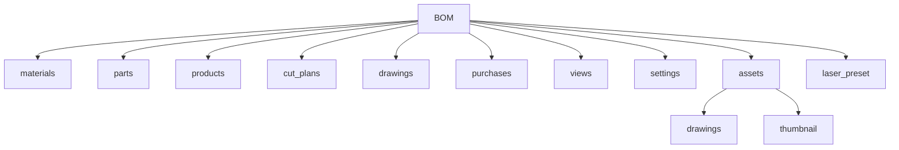

# BOM システム セットアップマニュアル

## 目次

1. [はじめに](#1-はじめに)
2. [フォルダ・ファイルの準備](#2-フォルダファイルの準備)
3. [必須プラグインのインストールと有効化](#3-必須プラグインのインストールと有効化)
4. [Templater の設定](#4-templater-の設定)
5. [QuickAdd の設定](#5-quickadd-の設定)
6. [CSS スニペットの有効化](#6-css-スニペットの有効化)
7. [動作確認](#7-動作確認)

---

## 1. はじめに

### 1.1 本マニュアルの目的

このマニュアルは、**新規で Vault を用意した人**が、Obsidian 上で BOM システムを動かせる状態まで、プラグイン・フォルダ・設定を一通り整える手順をまとめたものです。

セットアップを完了すると、[BOM システム使い方マニュアル](BOMシステム使い方マニュアル.md)の「1. はじめに」で述べている前提（必要なプラグイン・フォルダ構成・CSS スニペット）が満たされた状態になります。**セットアップ完了後は、使い方マニュアルを参照して運用してください。**

### 1.2 前提条件

- **Obsidian** がインストール済みであること。本システムは現行の Obsidian（v1.x）で動作確認されています。
- この Vault を Obsidian で開ける状態であること。

### 1.3 セットアップ後の流れ

1. 本マニュアルの 2〜7 の手順を実施する。
2. [BOM システム使い方マニュアル](BOMシステム使い方マニュアル.md) に従い、材料・部品・製品の登録や BOM ビューの利用を開始する。

---

## 2. フォルダ・ファイルの準備

### 2.1 Vault 内のフォルダ構成

BOM 用のノートはすべて `BOM/` 配下に置きます。次のフォルダを Vault 内に作成してください。

| フォルダ | 内容 |
|----------|------|
| `BOM/materials/` | 材料マスタ（M-0001 形式） |
| `BOM/parts/` | 部品マスタ（P-0001 形式） |
| `BOM/products/` | 製品定義（PR-001 形式） |
| `BOM/cut_plans/` | カットプラン（CP-0001 形式） |
| `BOM/drawings/` | 図面ノート（DW-0001 形式） |
| `BOM/purchases/` | 購入履歴（PO-日付_材料名 形式） |
| `BOM/views/` | BOM ビュー・原材料単価リストなど |
| `BOM/settings/` | 加工費レートなど設定ノート |
| `BOM/assets/drawings/` | 図面 SVG ファイル |
| `BOM/assets/thumbnail/` | サムネイル画像 |
| `BOM/laser_preset/` | レーザー加工プリセット（JSON） |

フォルダ構成のイメージ（mermaid）:



### 2.2 テンプレートの確認

次のテンプレートが Vault 内の **`templates/`** フォルダに存在することを確認してください。リポジトリや配布物から Vault をコピーした場合は、すでに含まれていることがあります。

| ファイル | 用途 |
|----------|------|
| `templates/material_template.md` | 材料ノート作成時 |
| `templates/part_template.md` | 部品ノート作成時 |
| `templates/product_template.md` | 製品ノート作成時 |
| `templates/cut_plan_template.md` | カットプラン作成時 |
| `templates/drawing_template.md` | 図面ノート作成時 |
| `templates/purchase_template.md` | 購入履歴作成時 |
| `templates/bom_view_template.md` | BOM ビュー作成時 |

不足している場合は、同じ Vault を参照している他の環境や配布元から `templates/` 一式をコピーしてください。

### 2.3 スクリプトの確認

QuickAdd から呼び出す次のスクリプトが、Vault 内の **`scripts/`** フォルダに存在することを確認してください。

| ファイル | 用途（QuickAdd マクロ名） |
|----------|---------------------------|
| `scripts/quickadd_add_bom_component.js` | Add BOM Component |
| `scripts/quickadd_create_bom_view.js` | Create BOM View |
| `scripts/rename_drawing.js` | rename drawing note |
| `scripts/quickadd_apply_process_cost.js` | Calculate Process Cost |

パスはすべて **Vault 内の相対パス**（`scripts/...`）で指定します。絶対パスやマシン固有のパスは使わないでください。

### 2.4 初期設定ファイルの作成

加工費の計算に使う設定ノートを 1 つ用意します。

**作成場所**: `BOM/settings/加工費レート.md`

**内容の例**（必要に応じて `name` や `hourly_rate` を編集してください）:

```yaml
---
type: process_rate
name: 30Wレーザー
hourly_rate: 1500
tags:
modified on:
---

## 説明

- **hourly_rate**: 時給単価（円/時）。加工費の自動計算に使用します。
- BOM ビューでは、部品の `process_cost` が未設定で `process_time_minutes` がある場合、`process_time_minutes × (hourly_rate / 60)` で加工単価を計算して表示します。
- **hourly_rate を変更したら**、自動計算したい部品では QuickAdd で「Calculate Process Cost」を実行し直すとよいです。
```

- **type**: `process_rate` のままにしてください（BOM ビューがこのノートを識別するため）。
- **hourly_rate**: 時給単価（円/時）。正の数で設定してください。

---

## 3. 必須プラグインのインストールと有効化

### 3.1 コミュニティプラグインの有効化

1. Obsidian の **設定**（Settings）を開く。
2. **コミュニティプラグイン**（Community plugins）で **制限モードをオフにする**（または「安全モードを無効にする」）。
3. **プラグインを有効にする**（Turn on community plugins）で、コミュニティプラグインを利用可能にする。

### 3.2 必須プラグインのインストール

次の 4 つを **検索してインストール**し、インストール後に **有効化**してください。

| プラグイン | 用途 |
|------------|------|
| **Templater** | フォルダごとのテンプレート自動適用（連番・ファイル名付与） |
| **QuickAdd** | マクロ実行（Add BOM Component / Create BOM View / rename drawing note / Calculate Process Cost） |
| **Dataview** | BOM ビュー・原材料単価リストの集計・表・チャート用クエリ |
| **obsidian-charts** | 原価構成（円グラフ）・部品別コスト（棒グラフ）の表示 |

手順の目安:

1. 設定 → コミュニティプラグイン → **閲覧**（Browse）。
2. 上記の名前で検索し、**インストール**（Install）→ **有効にする**（Enable）。

### 3.3 オプションのプラグインについて

Vault によっては **metadata-menu**、**maps**、**obsidian-linter** などが入っている場合があります。これらは **本 BOM システムの必須ではありません**。使い方マニュアルでは触れていないため、セットアップではインストールしなくても動作します。必要に応じて個別に導入してください。

---

## 4. Templater の設定

### 4.1 テンプレートフォルダ

1. 設定 → **Templater** を開く。
2. **Template folder location** に **`templates`** を指定する（Vault 内の `templates` フォルダを指す相対パス）。

### 4.2 フォルダテンプレートの有効化とペア設定

1. Templater の設定で **Folder templates** を **有効にする**（Enable folder templates）。
2. **Trigger Templater on new file creation**（ファイル作成時にトリガー）を **有効にする**。
3. 次の **フォルダとテンプレートのペア**を 1 つずつ追加する。

| フォルダ | テンプレート |
|----------|--------------|
| BOM/parts | templates/part_template.md |
| BOM/drawings | templates/drawing_template.md |
| BOM/products | templates/product_template.md |
| BOM/views | templates/bom_view_template.md |
| BOM/materials | templates/material_template.md |
| BOM/purchases | templates/purchase_template.md |
| BOM/cut_plans | templates/cut_plan_template.md |

設定画面では「フォルダ」に上記の左列（例: `BOM/materials`）、「テンプレート」に右列（例: `templates/material_template.md`）を指定します。パスは Vault ルートからの相対パスで統一してください。

### 4.3 ユーザースクリプトフォルダ（任意）

Templater の **User scripts folder** に **`scripts`** を指定している場合、そのままで問題ありません。本 BOM では主に QuickAdd が `scripts/` 内の JS を参照します。

---

## 5. QuickAdd の設定

### 5.1 マクロの登録手順

QuickAdd では **マクロ** として **UserScript** を 4 つ登録します。

1. 設定 → **QuickAdd** を開く。
2. **Macro** を追加し、その中に **User Script** を 1 つ追加する。
3. **User Script** の **Path** に、次の「スクリプトパス」を指定する（Vault 内の相対パス）。
4. マクロの表示名を、下記「マクロ名」のとおりにすると、使い方マニュアルやホットキー例と一致します。

| マクロ名 | スクリプトパス |
|----------|----------------|
| Add BOM Component | scripts/quickadd_add_bom_component.js |
| Create BOM View | scripts/quickadd_create_bom_view.js |
| rename drawing note | scripts/rename_drawing.js |
| Calculate Process Cost | scripts/quickadd_apply_process_cost.js |

手順の目安（QuickAdd の UI に依存します）:

- **Choice** または **Macro** を追加 → タイプで **Macro** を選択 → マクロ内に **User Script** を追加 → **Path** に上記の `scripts/...` を入力。
- マクロを 4 つ作り、それぞれに上記の名前とパスを設定する。

### 5.2 ホットキー（任意）

ホットキーは任意です。設定する場合は、設定 → **ホットキー**（Hotkeys）で QuickAdd の各マクロにキーを割り当ててください。

**設定例**（環境により Mod は Ctrl または Cmd）:

| マクロ名 | ホットキー例 |
|----------|--------------|
| Add BOM Component | Mod+Q |
| Create BOM View | Mod+Shift+Q |
| rename drawing note | Mod+R |
| Calculate Process Cost | Mod+Shift+C |

---

## 6. CSS スニペットの有効化

BOM ビューのチャート表示用に、CSS スニペット **bom-sharts** を有効にします。

1. **bom-sharts.css** が Vault 内の **`.obsidian/snippets/bom-sharts.css`** に存在することを確認する。リポジトリや配布物からコピーした場合は、すでに含まれていることがあります。
2. 設定 → **外観**（Appearance）→ **CSS スニペット**（CSS snippets）を開く。
3. 一覧から **bom-sharts** を探し、トグルを **ON** にする。

これで、BOM ビューノート内の原価構成チャートや部品別コストのレイアウトが正しく表示されます。

---

## 7. 動作確認

次のチェックリストで、セットアップが完了しているか確認してください。

### 7.1 Templater の動作確認

- **BOM/materials/** で新規ノートを 1 つ作成する。
- テンプレートが自動で適用され、frontmatter に **M-xxxx** 形式の連番が入り、ファイル名が **M-xxxx_新規材料** のようになっていること。

同様に、**BOM/parts/** や **BOM/products/** などでも新規作成し、それぞれのテンプレート（P-xxxx、PR-xxx など）が適用されることを確認してもよいです。

### 7.2 QuickAdd の動作確認

- **BOM/products/** に製品ノートが 1 つ以上ある状態で、その製品ノートを開く。
- コマンドパレット（Ctrl/Cmd+P）から **QuickAdd: Add BOM Component** を実行する。
- ダイアログや選択肢が表示され、エラーにならないこと。

同様に **Create BOM View** や **Calculate Process Cost** も、対象ノートを開いた状態で実行できることを確認してください。

### 7.3 加工費レートの確認

- **BOM/settings/加工費レート.md** が存在すること。
- frontmatter に **hourly_rate** が正の数で設定されていること。

### 7.4 BOM ビューとチャートの確認（サンプルがある場合）

- Vault に既存の BOM ビューノート（例: `BOM/views/BOM_PR-001_干支の寿ぎ(単品)_チーク板目.md`）がある場合、そのノートを開く。
- Dataview の表やクエリが表示されること。
- **obsidian-charts** と **bom-sharts** が有効な場合、原価構成の円グラフや部品別コストの棒グラフが表示されること。

---

## セットアップ完了後

上記まで完了したら、[BOM システム使い方マニュアル](BOMシステム使い方マニュアル.md) に従って、材料・部品・製品の登録や BOM ビューの作成・運用を進めてください。
