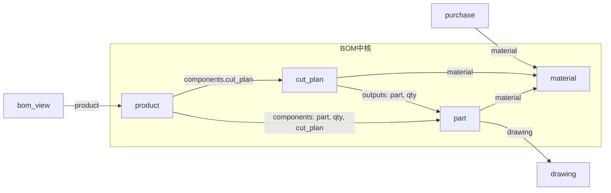

# BOM システム使い方マニュアル

## 目次

1. [はじめに](#1-はじめに)
2. [マスターデータの登録](#2-マスターデータの登録)
3. [カットプランと図面](#3-カットプランと図面)
4. [製品 BOM の登録](#4-製品-bom-の登録)
5. [BOM ビューの使い方](#5-bom-ビューの使い方)
6. [その他のビュー・運用](#6-その他のビュー運用)
7. [トラブルシューティング](#7-トラブルシューティング)

---

## 1. はじめに

### 1.1 BOM システムの目的

このシステムは Obsidian 上で**部品（part）・材料（material）・製品（product）** を管理し、**原価（材料費・加工費）** を集計するための簡易 BOM（Bill of Materials）です。

- 製品ごとに部品構成（components）を定義
- カットプラン（1枚取りなど）に基づく材料費の個数配賦
- 部品の加工時間から加工費の自動計算
- BOM ビューで製品サマリー・原価構成チャート・明細表を表示

**初回セットアップ**: まだプラグインやフォルダを用意していない場合は、先に [BOM システムセットアップマニュアル](BOMシステムセットアップマニュアル.md) で環境を整えてください。

### 1.2 必要なプラグイン

| プラグイン | 用途 |
|------------|------|
| **Templater** | フォルダごとのテンプレート自動適用（連番・リネーム） |
| **QuickAdd** | マクロ実行（Add BOM Component / Create BOM View / Calculate Process Cost / rename drawing note） |
| **Dataview** | BOM ビュー・原材料単価リストの集計・表・チャート用クエリ |
| **obsidian-charts** | 原価構成（円グラフ）・部品別コスト（棒グラフ）の表示 |

さらに、**CSS スニペット「bom-sharts」**を有効にしてください（設定 → 外観 → CSS スニペット）。BOM ビューのチャート表示用です。

### 1.3 フォルダ構成の概要

すべての BOM 用ノートは `BOM/` 配下にあります。

| フォルダ | 内容 |
|----------|------|
| `BOM/materials/` | 材料マスタ（M-0001 形式） |
| `BOM/parts/` | 部品マスタ（P-0001 形式） |
| `BOM/products/` | 製品定義（PR-001 形式） |
| `BOM/cut_plans/` | カットプラン（CP-0001 形式） |
| `BOM/drawings/` | 図面ノート（DW-0001 形式） |
| `BOM/purchases/` | 購入履歴（PO-日付_材料名 形式） |
| `BOM/views/` | BOM ビュー・原材料単価リストなど |
| `BOM/settings/` | 加工費レートなど設定ノート |
| `BOM/assets/drawings/` | 図面 SVG ファイル |
| `BOM/assets/thumbnail/` | サムネイル画像 |
| `BOM/laser_preset/` | レーザー加工プリセット（JSON） |

### 1.4 データモデル（概要）

このシステムで扱うエンティティと、ノート間の参照関係を整理します。登録手順（2章以降）を読むときの地図として参照してください。

#### エンティティ一覧

| エンティティ | 説明 | 主な参照先 |
|-------------|------|------------|
| product（製品） | 製品定義。部品構成（components）を持つ | — |
| part（部品） | 部品マスタ。材料・図面を参照 | material, drawing |
| material（材料） | 材料マスタ。単価・単位を保持 | — |
| cut_plan（カットプラン） | 1材料から複数部品の取り数を定義 | material, outputs(part, qty) |
| drawing（図面） | 部品に紐づく図面ノート | part |
| purchase（購入履歴） | 材料別の数量・金額 | material |
| process_rate（加工費レート） | 設定ノート。時給単価を保持 | — |
| bom_view（BOM ビュー） | 表示用。製品の原価サマリー等を表示 | product |

#### 関係図



#### 主要なリンクの整理

- **製品 → 部品**: `product.components` の各要素に `part`（部品ノート）、`qty`、任意で `cut_plan`。
- **部品 → 材料・図面**: `part.material` で材料ノート、`part.drawing` で図面ノート。材料費は cut_plan 指定時はカットプラン経由、未指定時は part の material / units_per_material / yield で計算。
- **カットプラン → 材料・部品**: `cut_plan.material` で材料、`cut_plan.outputs` で部品と数量。BOM ビューはここから部品1個あたり材料費を個数配賦。
- **購入履歴 → 材料**: `purchase.material` で材料。材料単価が未設定のとき、BOM ビューは購入履歴の数量加重平均を参照。
- **BOM ビュー → 製品**: `bom_view.product` で表示対象の製品ノートを指定。

---

## 2. マスターデータの登録

### 2.1 材料（material）

**作成場所**: `BOM/materials/` にノートを新規作成する。

Templater のフォルダテンプレートが有効なため、新規ノート作成時に `templates/material_template.md` が適用され、**M-0001, M-0002, …** の連番とファイル名 `M-xxxx_新規材料` が自動付与されます。ファイル名は後から変更して構いません。

**frontmatter の主な項目**:

| 項目 | 説明                                                                                      |
|------|------|
| `type` | `material`（必須）                                                                          |
| `material_no` | テンプレートで自動設定（M-0001 等）                                                                   |
| `name` | 材料名（例: MDF板_2.5mm_クリア塗装）                                                                |
| `purchase_unit_cost` | 購入単価（円/単位）。BOM ビューで材料費計算に使用                                                             |
| `uom` | **必須**。単位。例: sheet（枚）, m（メートル）, pcs（個）, g, kg など。BOM ビューで「材料単価（円/単位）」の意味を明示するため必ず設定すること |
| `supplier` | 仕入先名（任意）                                                                                |
| `purchase_date` | 購入日（任意）                                                                                 |
| `tags` | タグ（任意）                                                                                  |

**材料単価の優先順位**  
材料単価は次の優先順位で決まります。(1) 材料ノートの **avg_unit_cost**（数値）(2) 材料ノートの **purchase_unit_cost**（数値）(3) **購入履歴（purchases）** を材料別に集計した数量加重平均（BOM ビューが自動計算）。購入履歴さえあれば、材料ノートに avg_unit_cost を入れなくても BOM ビューで材料費が計算されます。固定の単価を使いたい場合は、材料ノートに avg_unit_cost または purchase_unit_cost を設定してください。

**例**（`BOM/materials/M-0001_MDF板_2.5mm.md`）:

```yaml
---
type: material
material_no: M-0001
name: MDF板_2.5mm
purchase_unit_cost: 100
uom: sheet
supplier: xxx商店
tags:
modified on: 2026-01-25 21:34:31
---
```

### 2.2 購入履歴（purchase）

**作成場所**: `BOM/purchases/` にノートを新規作成する。

`templates/purchase_template.md` は YAML のみのシンプルなテンプレートです。ファイル名は **`PO-YYYY-MM-DD_材料のbasename`** 形式（例: `PO-2025-06-11_M-0001_MDF板_2.5mm.md`）にすると管理しやすいです。

**frontmatter の主な項目**:

| 項目             | 説明                                     |
| -------------- | -------------------------------------- |
| `type`         | `purchase`                             |
| `material`     | 材料ノートへのリンク（例: `[[M-0001_MDF板_2.5mm]]`） |
| `purchased_on` | 購入日（YYYY-MM-DD 推奨）                     |
| `vendor`       | 仕入先                                    |
| `qty`          | 数量                                     |
| `total_amount` | 合計金額（円）                                |
| `note`         | メモ（任意）                                 |

購入履歴は **原材料単価リスト**（`BOM/views/原材料単価リスト.md`）で材料別に集計され、平均単価が表示されます。BOM ビューは、材料ノートに avg_unit_cost / purchase_unit_cost が無い場合、購入履歴（purchases）からその材料の数量加重平均を自動計算して材料費に使います。手動で固定値を使いたい場合のみ、材料ノートに avg_unit_cost を設定してください。

**例**:

```yaml
---
type: purchase
material: "[[M-0001_MDF板_2.5mm]]"
purchased_on: 2025-06-11
vendor: xxx商店
qty: 12
total_amount: 1200
note:
---
```

### 2.3 部品（part）

**作成場所**: `BOM/parts/` にノートを新規作成する。

テンプレート `templates/part_template.md` により **P-0001, P-0002, …** の連番と `P-xxxx_新規パーツ` というファイル名が付与されます。

**frontmatter の主な項目**:

| 項目 | 説明 |
|------|------|
| `type` | `part`（必須） |
| `part_no` | テンプレートで自動（P-0001 等） |
| `name` | 部品名 |
| `material` | 使用材料ノートへのリンク。BOM ビューで材料費計算に使用（cut_plan 未指定時） |
| `drawing` | 図面ノートへのリンク（任意） |
| `units_per_material` | 材料1単位あたりの製造個数（cut_plan 未使用時の材料費計算用） |
| `yield` | 歩留まり（0〜1）。未設定時は 1 扱い（cut_plan 未使用時） |
| `process_cost` | 加工費（円/個）。未設定の場合は後述の「加工費の自動計算」で算出可能 |
| `process_time_minutes` | 加工時間（分）。process_cost が未設定かつ加工費レートが参照できる場合、BOM ビューで自動計算される |
| `unit_cost` | 任意（手動用） |
| `status` | 例: draft / released |
| `tags` | タグ |

**例**（`BOM/parts/P-0001_部品A_MDF.md`）:

```yaml
---
type: part
part_no: P-0001
name: 部品A_MDF
material: "[[M-0001_MDF板_2.5mm]]"
drawing: "[[DW-0001_P-0001_部品A_MDF_revA]]"
units_per_material: 10
yield: 0.8
process_cost: 105
process_time_minutes: 4.2
status: draft
tags:
  - パズル
modified on: 2026-01-25 22:29:01
---
```

### 2.4 加工費レート（設定）

**ファイル**: `BOM/settings/加工費レート.md`

部品の `process_time_minutes` から加工費を算出する際の**時給単価**を定義します。

**frontmatter**:

| 項目 | 説明 |
|------|------|
| `type` | `process_rate` |
| `name` | レート名（例: 30Wレーザー） |
| `hourly_rate` | 時給単価（円/時） |

BOM ビューと QuickAdd（Calculate Process Cost）はともに **`BOM/settings/加工費レート`**（ファイル: `BOM/settings/加工費レート.md`）を参照します。ファイルはそのまま settings 配下に置いて問題ありません。

**例**（`BOM/settings/加工費レート.md`）:

```yaml
---
type: process_rate
name: 30Wレーザー
hourly_rate: 1500
tags:
modified on:
---
```

### 2.5 加工費の自動計算（QuickAdd）

部品ノートに **`process_time_minutes`** を入力済みで、**加工費レート**（`hourly_rate`）が参照できる状態であれば、**QuickAdd** で **`process_cost`** を一括反映できます。

1. **部品ノート**（`type: part`）を開く。
2. QuickAdd の **「Calculate Process Cost」** マクロを実行する。
3. `process_cost = round(process_time_minutes × (hourly_rate / 60))` が計算され、そのノートの frontmatter に **`process_cost`** が書き込まれる。

加工費レートは **`BOM/settings/加工費レート.md`** の `hourly_rate` を参照しています（QuickAdd スクリプト `scripts/quickadd_apply_process_cost.js` の設定）。`hourly_rate` を変更したあとは、自動計算したい部品で再度「Calculate Process Cost」を実行するとよいです。

---

## 3. カットプランと図面

### 3.1 カットプラン（cut_plan）

**作成場所**: `BOM/cut_plans/` にノートを新規作成する。

テンプレート `templates/cut_plan_template.md` により **CP-0001, CP-0002, …** の連番と `CP-xxxx_新規カットプラン` というファイル名が付与されます。

カットプランは「ある材料を何枚（何単位）使って、どの部品を何個ずつ取り出すか」を定義します。**製品ノートの components で、部品ごとに cut_plan を指定すると、BOM ビューで材料費が個数配賦で計算**されます。

**frontmatter の主な項目**:

| 項目 | 説明 |
|------|------|
| `type` | `cut_plan` |
| `plan_no` | テンプレートで自動（CP-0001 等） |
| `material` | 使用する材料ノート（`BOM/materials/`）へのリンク |
| `source_qty` | 材料の単位あたり数量（例: 1 枚） |
| `yield` | 歩留まり（0〜1）。未設定時は 1 扱い |
| `outputs` | このカットから得られる部品と数量の一覧。各要素は `part`（部品ノートリンク）と `qty`（個数） |
| `note` | メモ（任意） |

製品の components で `cut_plan: "[[CP-0001_...]]"` を指定すると、BOM ビューはそのカットプランの material / source_qty / yield / outputs から「部品1個あたりの材料費」を算出し、材料費合計に反映します。

**例**（`BOM/cut_plans/CP-0001_パターン1.md`）:

```yaml
---
type: cut_plan
plan_no: CP-0001
material: "[[M-0001_MDF板_2.5mm]]"
source_qty: 1
yield: 0.85
outputs:
  - part: "[[P-0001_部品A_MDF]]"
    qty: 6
  - part: "[[P-0002_部品B_MDF]]"
    qty: 6
note: 1枚取り：部品A 6/部品B 6
tags:
modified on:
---
```

### 3.2 図面（drawing）

**作成場所**: `BOM/drawings/` にノートを新規作成する。

テンプレート `templates/drawing_template.md` では、**Revision** を入力すると **DW-0001, DW-0002, …** の連番と `DW-xxxx_新規図面_revX` というファイル名が付与されます。

**frontmatter の主な項目**:

| 項目 | 説明 |
|------|------|
| `type` | `drawing` |
| `drawing_no` | テンプレートで自動（DW-0001 等） |
| `part` | 対応する部品ノートへのリンク |
| `rev` | リビジョン（例: A） |
| `released` | リリース日（任意） |
| `status` | 例: draft / released |
| `svg` | 図面ファイル（パスやリンク） |
| `thumbnail` | サムネイル画像 |
| `laser_preset` | レーザー加工プリセット（`BOM/laser_preset/` 内の JSON 名など） |
| `notes` | メモ |

### 3.3 図面ノートのリネーム（QuickAdd）

図面ノートを **`DW-xxxx_P-nnnn_部品名_revX`** 形式に統一したい場合に使います。

1. **図面ノート**（`type: drawing`）を開く。
2. frontmatter の **`part`** に部品ノートへのリンクが入っていることを確認する。
3. QuickAdd の **「rename drawing note」** マクロを実行する。
4. ファイル名が `drawing_no` + `part` の part_no / name + `rev` から生成され、リネームされる。

---

## 4. 製品 BOM の登録

### 4.1 製品（product）

**作成場所**: `BOM/products/` にノートを新規作成する。

テンプレート `templates/product_template.md` により **PR-001, PR-002, …** の連番と `PR-xxx_新規製品` というファイル名が付与されます。

**frontmatter の主な項目**:

| 項目 | 説明 |
|------|------|
| `type` | `product` |
| `product_no` | テンプレートで自動（PR-001 等） |
| `name` | 製品名 |
| `components` | 部品構成のリスト。各要素は `part`（部品ノートリンク）、`qty`（数量）、および任意で `cut_plan`（カットプランリンク） |

**例**（`BOM/products/PR-001_製品A_MDF.md`）:

```yaml
---
type: product
product_no: PR-001
name: 製品A_MDF
components:
  - part: "[[P-0001_部品A_MDF]]"
    qty: 1
    cut_plan: "[[CP-0001_パターン1]]"
  - part: "[[P-0002_部品C_MDF]]"
    qty: 1
    cut_plan: "[[CP-0002_パターン2]]"
modified on: 2026-01-25 22:37:52
---
```

### 4.2 Add BOM Component（QuickAdd）

製品ノートの **components** や、カットプランノートの **outputs** を、ダイアログで追加・編集・削除するためのマクロです。

**実行手順**:

1. **製品ノート**（`type: product`）または **カットプランノート**（`type: cut_plan`）を開く。
2. QuickAdd の **「Add BOM Component」** マクロを実行する。
3. **「既存 components から編集」** または **「parts 一覧から追加」** を選ぶ。
4. 部品を選び、**数量（qty）** を入力する。0 を入力するとその行は削除される。
5. 製品ノートの場合は、**cut_plan を指定する / 指定しない** を選べる。指定する場合は `BOM/cut_plans/` 内のノートから選択する。
6. 確定すると frontmatter の `components`（製品）または `outputs`（カットプラン）が更新される。

---

## 5. BOM ビューの使い方

### 5.1 Create BOM View（QuickAdd）

製品ごとに「BOM ビュー」ノートを作成し、その製品のサマリー・原価構成・明細を一覧するために使います。

**実行手順**:

1. **製品ノート**（`type: product`）を開く。
2. QuickAdd の **「Create BOM View」** マクロを実行する。
3. ファイル名を入力する（既定は `BOM_<製品のbasename>`。例: `BOM_PR-001_製品A_MDF`）。
4. `BOM/views/` に新しいノートが作成され、frontmatter の **`product`** に、開いていた製品ノートへのリンクが入る。
5. 作成されたノートが開く。Dataview により製品サマリー・原価構成（円グラフ）・部品別コスト Top3（棒グラフ）・明細表が表示される。

テンプレートは `templates/bom_view_template.md` です。新規作成時はこのテンプレートの内容が使われ、`product` だけが現在の製品ノートに差し替えられます。**テンプレートを更新したあと**は、既存の BOM ビューファイル（`BOM_PR-001_...` 等）には自動では反映されません。新しい表示やチェックを使いたい場合は、該当ビューを手動でテンプレートと同期するか、必要に応じて QuickAdd で BOM ビューを再作成してください。

### 5.2 BOM ビューで表示される内容

- **製品サマリー**: 製品ID・名前・部品点数・総数量・材料費合計・加工費合計・総原価・加工費比率
- **原価構成ダッシュボード**: 材料費/加工費の円グラフ、部品別コスト Top3 の棒グラフ（obsidian-charts + bom-sharts スニペット）
- **未設定・警告**: 材料費が計算できない行や設定ミス疑いの理由一覧
- **明細表**: 部品・数量・材料参照・材料単価・取数・歩留まり・材料費（理論/歩留込み）・加工単価・加工費・合計原価・cut_plan

### 5.3 既存 BOM ビューの product の変更

別の製品を表示したい場合は、BOM ビューノートの **frontmatter** を開き、**`product`** のリンクを対象の製品ノートに書き換えます。例: `product: "[[PR-001_製品A_MDF]]"`。

### 5.4 加工費が 0 になる場合の確認ポイント

- **加工費レートの参照パス**: 加工費レートは `BOM/settings/加工費レート.md` を参照しています。パスを変更していなければ、ファイルがそこに存在し hourly_rate が設定されていれば参照されます。
- **部品の process_cost / process_time_minutes**: 部品に `process_cost` が入っていない場合は、`process_time_minutes` と加工費レートから BOM ビュー内で自動計算されます。どちらも未設定だと加工費は 0 になります。必要に応じて「Calculate Process Cost」で `process_cost` を書き込むか、`process_time_minutes` を入力してください。

---

## 6. その他のビュー・運用

### 6.1 原材料単価リスト

**ファイル**: `BOM/views/原材料単価リスト.md`

購入履歴（`BOM/purchases/`）を材料別に集計し、**Material / Total Qty / Avg Unit Cost (JPY) / Last Purchase** の表を表示します。ここで表示される平均単価は、BOM ビューが purchases から計算する単価と同じ考え方です。材料ノートに avg_unit_cost を設定しない場合、BOM ビューは購入履歴から自動でこの平均を使います。

### 6.2 材料費計算の二通り

材料単価は、材料ノートの **avg_unit_cost** → **purchase_unit_cost** の順で参照し、どちらも無い場合は**購入履歴（purchases）**から BOM ビューが数量加重平均を計算して使用します。

- **cut_plan を指定した場合**: 製品の component に `cut_plan` が指定されていると、そのカットプランの material / source_qty / yield / outputs から「部品1個あたりの材料費」を個数配賦で計算します（上記の優先順位で材料単価を参照）。
- **cut_plan を指定しない場合**: 部品ノートの **material**（材料ノート）と **units_per_material** **yield** から、部品1個あたりの材料費を計算します（上記の優先順位で材料単価を参照）。

### 6.3 ファイル命名規則のまとめ

| 種別      | 形式                      | 例                               |
| ------- | ----------------------- | ------------------------------- |
| 部品      | P-0001_部品名              | P-0001_部品A_MDF                  |
| 製品      | PR-001_製品名              | PR-001_製品A_MDF                  |
| カットプラン  | CP-0001_名前              | CP-0001_パターン1                   |
| 図面      | DW-0001_P-nnnn_部品名_revX | DW-0001_P-0001_部品A_MDF_revA     |
| 材料      | M-0001_材料名              | M-0001_MDF板_2.5mm               |
| 購入      | PO-YYYY-MM-DD_材料名       | PO-2025-06-11_M-0001_MDF板_2.5mm |
| BOM ビュー | BOM_製品名                 | BOM_PR-001_製品A_MDF              |

---

## 7. トラブルシューティング

### ビューに「製品ノートが見つかりません」と出る

- BOM ビューノートの frontmatter の **`product`** のリンク先を確認する。`BOM/products/` 配下の正しいファイル名（拡張子なし）を指定しているか確認する。
- 例: `product: "[[PR-001_製品A_MDF]]"` で、`BOM/products/PR-001_製品A_MDF.md` が存在するか確認する。

### 材料費が計算されない

- **cut_plan を使っている場合**: カットプランの **material** / **source_qty** / **yield** / **outputs**（各 part, qty）が正しく設定されているか確認する。材料ノートに **avg_unit_cost** または **purchase_unit_cost** が入っているか、あるいはその材料への購入履歴（purchases）が存在するか確認する。また、当該部品が outputs の part に含まれているか確認する。いずれかが揃っていれば BOM ビューで材料費が計算されます。
- **cut_plan を使っていない場合**: 部品ノートの **material**（材料ノートへのリンク）、**units_per_material**、必要に応じて **yield** を確認する。材料ノートに **avg_unit_cost** または **purchase_unit_cost** が入っているか、あるいはその材料への購入履歴（purchases）が存在するか確認する。いずれかが揃っていれば BOM ビューで材料費が計算されます。

### 加工費が 0 になる

- **加工費レートのパス**: 加工費レートノートは `BOM/settings/加工費レート.md` を参照しています。このパスにファイルがあるか、hourly_rate が正の数か確認してください。
- **hourly_rate**: 加工費レートノートの **hourly_rate**（円/時）が正の数になっているか確認する。
- **部品**: 部品に **process_cost** または **process_time_minutes** が設定されているか確認する。process_cost が未設定の場合は、process_time_minutes と hourly_rate から BOM ビュー内で計算される。

### チャートが表示されない

- **obsidian-charts** プラグインが有効か確認する。
- **bom-sharts** CSS スニペットが有効か確認する（設定 → 外観 → CSS スニペット）。
- BOM ビューノートを再読み込み（プレビューを一度閉じて開き直す）してみる。
